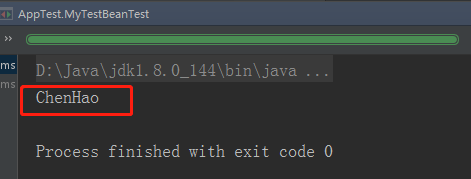

# IOC-容器的基本实现

## 概述

上一篇我们搭建完Spring源码阅读环境，spring源码深度解析—Spring的整体架构和环境搭建 这篇我们开始真正的阅读Spring的源码，分析spring的源码之前我们先来简单回顾下spring核心功能的简单使用

> 文章整理自[原文地址](https://www.cnblogs.com/java-chen-hao/p/11113340.html)

## 容器的基本用法

bean是spring最核心的东西，spring就像是一个大水桶，而bean就是水桶中的水，水桶脱离了水也就没有什么用处了，我们简单看下bean的定义，代码如下：

```java
public class MyTestBean {
    private String name = "ChenHao";

    public String getName() {
        return name;
    }
    public void setName(String name) {
        this.name = name;
    }
}
```

> 源码很简单，bean没有特别之处，spring的的目的就是让我们的bean成为一个纯粹的的`POJO`，这就是spring追求的

接下来就是在配置文件中定义这个bean，配置文件如下：

```xml
<?xml version="1.0" encoding="UTF-8"?>
<beans xmlns="http://www.springframework.org/schema/beans"
       xmlns:xsi="http://www.w3.org/2001/XMLSchema-instance"
       xsi:schemaLocation="http://www.springframework.org/schema/beans http://www.springframework.org/schema/beans/spring-beans.xsd">

    <bean id="myTestBean" class="com.chenhao.spring.MyTestBean"/>

</beans>
```

> 在上面的配置中我们可以看到bean的声明方式，在spring中的bean定义有N种属性，但是我们只要像上面这样简单的声明就可以使用了。 

具体测试代码如下：

```java
public class AppTest {
    @Test
    public void MyTestBeanTest() {
        BeanFactory bf = new XmlBeanFactory( new ClassPathResource("spring-config.xml"));
        MyTestBean myTestBean = (MyTestBean) bf.getBean("myTestBean");
        System.out.println(myTestBean.getName());
    }
}
```

运行上述测试代码就可以看到输出结果如下图：

 

> 其实直接使用BeanFactory作为容器对于Spring的使用并不多见，因为企业级应用项目中大多会使用的是ApplicationContext（后面我们会讲两者的区别，这里只是测试）

## 功能分析

接下来我们分析2中代码完成的功能；

- 读取配置文件spring-config.xml。 
- 根据spring-config.xml中的配置找到对应的类的配置，并实例化。 
- 调用实例化后的实例 

下图是一个最简单spring功能架构，如果想完成我们预想的功能，至少需要3个类：


> - `ConfigReader` 用于读取及验证自己直文件 我们妥用配直文件里面的东西，当然首先 要做的就是读取，然后放直在内存中.
> - `ReflectionUtil` 用于根据配置文件中的自己直进行反射实例化,比如在上例中 spring-config.xml 出现的<bean id="myTestBean" class="com.chenhao.spring.MyTestBean"/>，我们就可以根据 com.chenhao.spring.MyTestBean 进行实例化。
> - `App` 用于完成整个逻辑的串联。